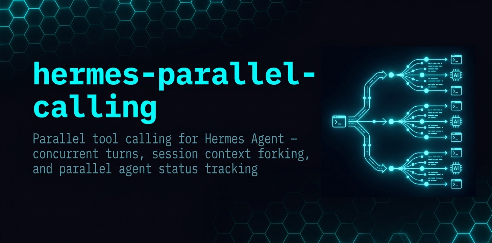
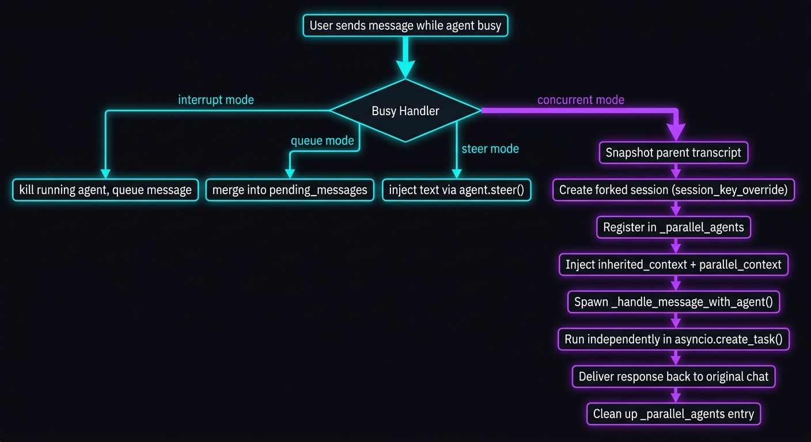
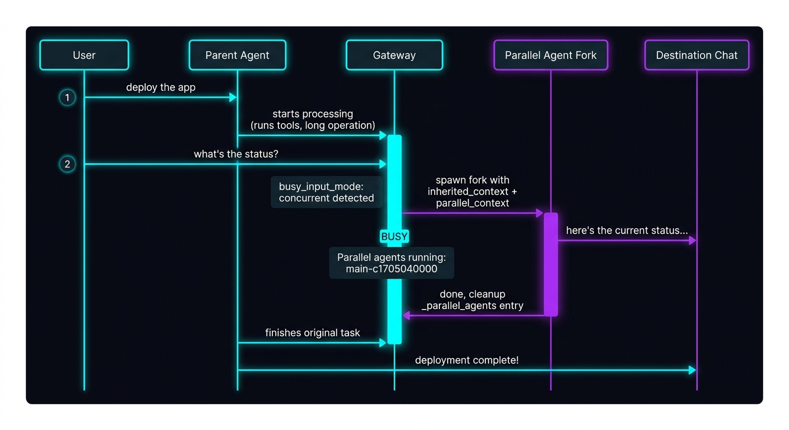

<p align="center">
  
</p>

# Hermes Parallel Calling

**Concurrent agent turns, session context forking, and parallel agent status for [Hermes Agent](https://github.com/NousResearch/hermes-agent).**

When `busy_input_mode: concurrent` is set, users can send messages to a running Hermes Agent without interrupting it — the new message spawns a **parallel forked session** instead.

## The Problem

Standard Hermes Agent processes messages synchronously: one turn at a time. When the agent is busy (running tools, calling APIs), incoming messages either:
- **Interrupt** — kill the current turn, losing work
- **Queue** — wait until the current turn finishes before processing

Neither is ideal when you want to ask a quick follow-up question while the agent is deploying infrastructure, running tests, or monitoring a long process.

## What This Adds

### 🧬 Concurrent Turns (`busy_input_mode: concurrent`)

Configure in `config.yaml`:
```yaml
display:
  busy_input_mode: concurrent
```

When a message arrives while the agent is busy, instead of interrupting or queueing, it spawns a **forked agent session** that runs in parallel. The original agent continues uninterrupted.

### 📜 Session Context Forking

The forked agent is **not blind**. It inherits the parent session's full conversation history via `inherited_context`, prepended with a system note:

> *"This is a parallel turn running alongside the main agent. Below is the main conversation history for context up to this point."*

This means the parallel agent knows what tools were called, what files were modified, and what state the conversation is in — no empty tool calls, no guessing.

### 👁️ Parallel Agent Status

Every parallel agent is tracked with metadata:
- **Fork key** (unique session identifier)
- **Start time** (for elapsed time display)
- **Message preview** (first 40 chars of what the user asked)

The busy handler ack message shows live status:
```
⚡ Processing in parallel...
Parallel agents running: main-c1705040000 (18s ago: 'deploy the...')
```

A `/parallel` slash command lists all running parallel agents.

### 🧠 Coordination Context

Each parallel agent gets injected system prompt context about its siblings:
```
## Parallel Coordination

You are parallel agent **main-c1705040000**.
No other siblings currently running.

You are running alongside other agents in the same chat. Coordinate to avoid conflicts:
- Before modifying files or shared state, check if a sibling has claimed the resource.
- Do NOT modify files another agent has claimed or is actively working on.
- When you finish, your sibling agents will see your results naturally.
```

### ⏱️ Cap at 1 Parallel Agent

Only one parallel agent per parent session at a time. If a second message arrives while a parallel fork is still running, it's queued in the parent's pending messages and processed when the parent's next turn starts.

## Architecture

<p align="center">
  
</p>

<p align="center">
  
</p>

## Key Implementation Details

| File | What Changed |
|------|-------------|
| `gateway/run.py` | `_run_concurrent_turn()`, `_get_parallel_agents_status()`, busy handler concurrent branch, `/parallel` command, `_parallel_agents` tracking, `inherited_context` parameter |
| `gateway/session.py` | `parallel_context_text` field on `SessionContext` for coordination prompt injection |

### session_key_override

The fork uses `session_key_override` (NOT chat_id mangling) to get a unique session. This is critical because Telegram's adapter does `int(chat_id)` on every send — string chat_ids crash.

```python
_fork_key = f"{parent_key}-c{_fork_ts}"
result = await self._handle_message_with_agent(
    event, source, _fork_key, 0,
    session_key_override=_fork_key,
    parallel_context_text=_parallel_context,
    inherited_context=_parent_history,
)
```

## Applying the Patch

```bash
cd /path/to/hermes-agent
git apply /path/to/parallel-concurrent-turns.patch
```

## Configuration

Enable in `~/.hermes/config.yaml`:
```yaml
display:
  busy_input_mode: concurrent
```

Available modes:
- `interrupt` (default) — kill current turn, start fresh
- `queue` — hold messages for next turn
- `steer` — inject text into running agent
- `concurrent` — spawn parallel forked session

## License

Same as Hermes Agent — PolyForm Shield.
